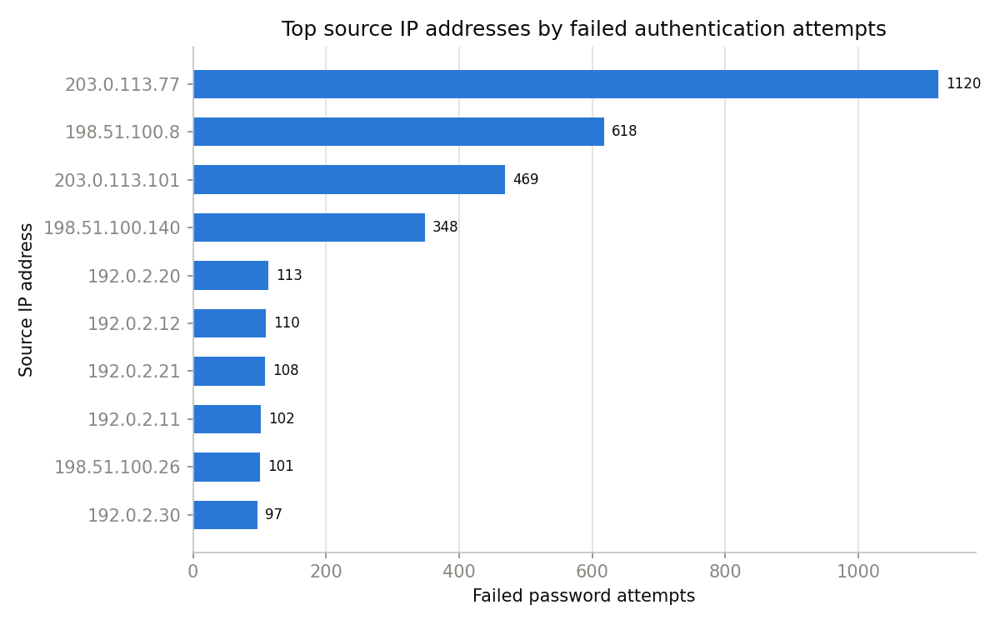
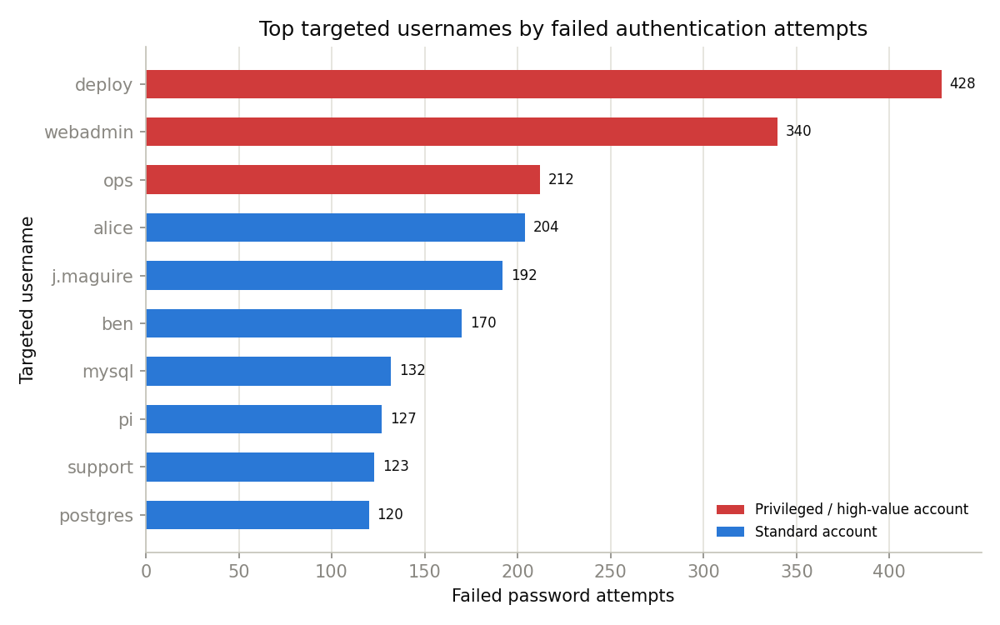
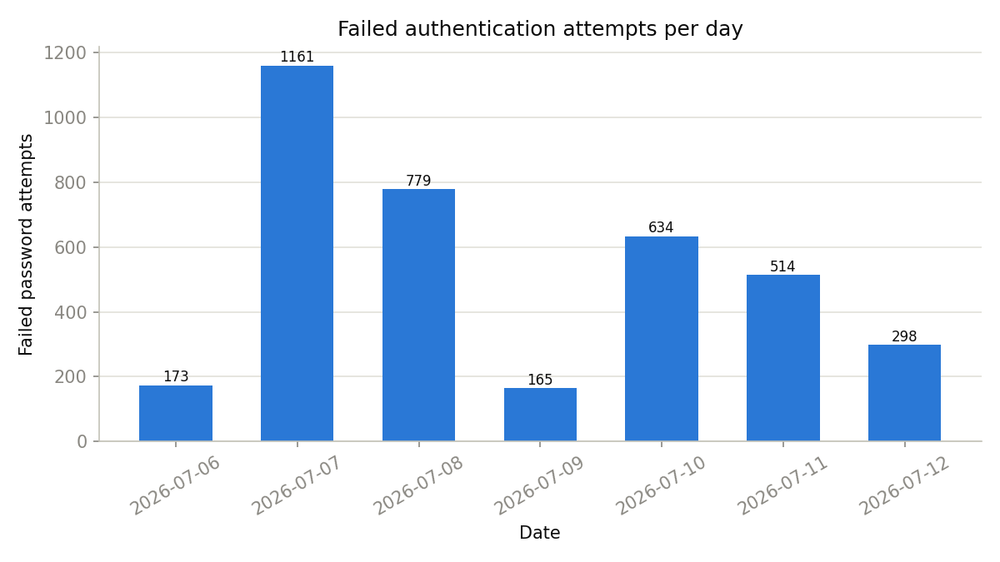
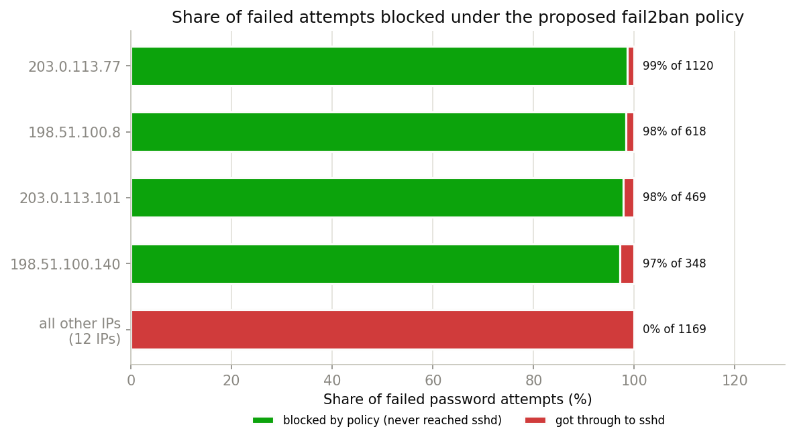
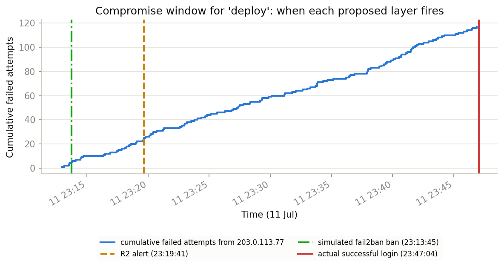

# Data-Driven Security Analysis and Defensive Response

**Group name or number:** Group BB
**Group members:** *(fill in before submission)*
**Assigned extract:** `1_auth.log`
**Chosen asset:** `web01`
**Part 1 evidence files:** `part1/README.md`, `part1/analysis.py`, `part1/output/`
**Part 2 selected risk or finding:** Risk 3, SSH password authentication on `web01` has no working rate limit or lockout

*This file is the single source of truth for the submission (intended to become `report.pdf`); there is no separate draft version of either part. Every quantitative claim in both parts was re-checked against the files in `part1/output/` and `part2/output/`, and two figures (see Part 1, section 2) were corrected in the process. Figures are embedded from `images/`; when converting to PDF, scale each figure to roughly a third of a page so the 3-page-per-part limit holds.*

---

## Part 1: Data-Driven Authentication Log Analysis

### 1. Security question and framing

We were given `1_auth.log` (Group BB's extract: 12,000 lines from a host
called `web01`, covering 6-12 July) and asked to figure out what an
organisation should actually be worried about in it. Rather than just
listing every failed login we could find, we tried to keep coming back to
one question:

> **Which authentication events or patterns on `web01` should be
> prioritised for investigation or response, and why?**

Everything below came out of `part1/analysis.py`, which we wrote to parse
the raw log and produce the tables/figures we're using as evidence (see
`part1/README.md` for how it works and why we made the parsing choices we
did). We leaned on AI tooling to help write the parser and draft this
section, which is declared in Appendix B, but every number quoted here
comes from actually running the script against our extract, not from
asking a model to summarise the log for us.

### 2. What we found

Running the script over all 12,000 lines (nothing was left unparsed once
we accounted for every message type sshd actually logs, see
`output/summary_counts.csv`) gave us 3,724 failed password attempts,
1,991 successful logins, and 1,468 "invalid user" notices, plus 443
`maximum authentication attempts exceeded` errors. On their own those
numbers don't say much, so we dug into where they were coming from and
when.

**The big one: a brute-force attempt that actually worked.** One IP,
`203.0.113.77`, threw 117 failed passwords at the `deploy` account inside
a 34-minute window (23:13-23:47 on 11 July) and then got in. The very
next line is `Accepted password for deploy` at 23:47:04
(`output/brute_force_success.csv`). Within seconds that session ran `sudo
systemctl restart apache2` as root (`output/sudo_commands.csv`). We
checked whether this was just a case of someone mistyping their password
a few times (ordinary IPs elsewhere in the log occasionally show 5 or 6
failed attempts right before a legitimate success), but nothing else
comes close to 117 in a tight burst, so we're treating this as a genuine
compromise rather than noise.

**It's not just that one IP.** Four source IPs, `203.0.113.77`,
`198.51.100.8`, `203.0.113.101`, and `198.51.100.140`, are responsible
for 2,555 of the 3,724 failed attempts in the whole extract, which is
69%. Everything else sits in the 84-113 range (Figure 1,
`output/top_source_ips.png`). Two of those four IPs also tripped sshd's
own `POSSIBLE BREAK-IN ATTEMPT!` reverse-DNS warning a combined 35 times.
That's not something we inferred, sshd flagged it itself.

**They're not going after random accounts either.** `deploy` (428 failed
attempts), `webadmin` (340), and `ops` (212) are the three most-targeted
usernames in the whole log, ahead of ordinary accounts like `alice` (204)
or `ben` (170), see Figure 2, `output/targeted_usernames.png`. All three
of those top accounts turn out to have `sudo` rights (we can see this in
`output/sudo_commands.csv`). `root` was hit 149 times too (109 failed +
40 invalid-user), though no `Accepted password for root` line shows up
anywhere in the extract, so at least on paper root itself held.

**And it comes in bursts, not a steady drip.** 7 July alone accounts for
1,161 failed attempts, more than the next busiest day (779 on the 8th),
while quieter days like the 9th sit around 165
(Figure 3, `output/failed_attempts_over_time.csv`). Whatever's hitting
`web01` isn't a constant background hum. It ramps up and dies down.

**Figure 1: Top 10 source IPs by failed password attempts (required visualisation)**



**Figure 2: Top 10 targeted usernames by failed password attempts, privileged accounts highlighted (chosen second visualisation)**



**Figure 3: Failed authentication attempts per day (supporting visualisation)**



### 3. What we think this means

Reading these together, the picture is fairly consistent: something
automated is repeatedly probing `web01`'s SSH login for weak credentials,
and it clearly prefers accounts that carry administrative privilege over
ordinary user accounts. That alone would be worth flagging. What makes it
more than a theoretical concern is that this pattern **already
succeeded once** inside the window we were given. The `deploy` account
was compromised, and the compromised session was used to run a privileged
command.

We want to be careful not to overclaim here, though. The log can't tell
us who was behind `203.0.113.77`, and it can't confirm anything the
attacker did beyond the one `sudo` command we can see. That command,
`systemctl restart apache2`, is itself one of the more awkward findings
in our analysis: it's run 60 other times across the extract by accounts
we have no reason to suspect, so on its own it looks completely ordinary.
Without the authentication pattern leading up to it, we'd have no way of
telling this instance apart from routine admin work, which is arguably a
finding in itself. `web01` currently has no way to distinguish "attacker
just logged in and ran a command" from "admin logged in and ran a command."

### 4. Risk summary

We've written this up properly as an asset-focused risk matrix in
Appendix A, including how confident we are in each one and what we're
still unsure about. In short, in priority order:

1. The `deploy` account compromise. This already happened, and `deploy`
   has sudo/root-equivalent access, so this is our top priority.
2. The broader credential-guessing campaign from the four high-volume
   IPs, which appears to be ongoing.
3. The apparent absence of any rate-limiting or lockout on SSH. Without
   this gap, the 117-attempt burst probably wouldn't have gotten anywhere.
4. Direct guessing against other privileged accounts (`root` especially),
   which hasn't succeeded yet but carries the worst impact if it does.
5. The difficulty of telling attacker activity apart from legitimate
   admin activity once someone's logged in.

### 5. What we'd recommend doing first

- Treat the `deploy` account as compromised right now, not as a
  hypothetical. Rotate its password immediately and go back through
  anything changed by or after that 23:47:04 session.
- Block or throttle the four IPs we flagged, at least until someone's
  had a chance to look into them properly. Two of them already tripped
  sshd's own break-in heuristic, which we think is enough to justify
  acting before a full investigation wraps up.
- Put some form of rate-limiting or account lockout on SSH password
  logins. fail2ban or similar would work, or moving to key-based auth
  entirely would remove password guessing as an option altogether.
- Add MFA (or just switch to keys) for the privileged accounts
  specifically: `root`, `deploy`, `webadmin`, `ops`, `sysadmin`. They're
  both the most targeted and the most damaging if guessed.
- Get some alerting in place for "burst of failures immediately followed
  by a success," because right now the only reason we caught this was by
  going back through the log after the fact.

### 6. Where we're not sure / what's missing

We should be upfront about the limits of what this log can tell us:

- This is one host over one week. We wouldn't want to assume the same
  pattern holds on other systems, or even on `web01` outside this window,
  and other groups working from the same base dataset may see
  completely different evidence in their extract.
- The IPs involved all sit in RFC 5737 documentation ranges
  (192.0.2.0/24, 198.51.100.0/24, 203.0.113.0/24), which lines up with
  this being a sanitised teaching dataset. There's no point trying to
  geolocate or reputation-check them.
- We can't actually prove the `deploy` login was illegitimate from the
  log alone. The burst-then-success pattern is strong circumstantial
  evidence, but it isn't a confession. We're comfortable calling it a
  compromise, but a stricter reviewer might want to call it "probable"
  rather than "confirmed."
- There's no firewall, IDS, or file-integrity log in this extract, so we
  genuinely don't know whether some control already exists and got
  bypassed, versus nothing being there at all.
- Full details on how we handled edge cases while parsing (e.g. the
  `Failed password for invalid user X` vs `Failed password for X`
  distinction) are in `part1/README.md`.

---

## Part 2: Technical Defensive Response

### 1. Which Part 1 risk we're addressing, and why it's the right priority

We're responding to **Risk 3 from our risk matrix: SSH password
authentication on `web01` has no working rate limit or lockout.** Of the
five risks we identified, this one isn't the scariest-sounding (Risk 1, the
actual `deploy` compromise, is), but we picked it deliberately, for three
reasons.

First, it's the *enabling condition* for the two risks above and below it:
the `deploy` compromise (Risk 1) only happened because one IP was allowed
117 uninterrupted guesses in 34 minutes, and the ongoing campaign (Risk 2)
only generates 3,724 failed attempts a week because nothing pushes back.
Rotating the compromised credential is necessary but reactive, it cleans
up after Risk 3 and leaves the door open for the next burst. Closing the
control gap changes the odds for every account at once.

Second, it's confirmed with unusually high confidence for a log-only
analysis: 117 failures from one IP without interruption
(`part1/output/brute_force_success.csv`), and 443 "maximum authentication
attempts exceeded" errors showing sshd's per-connection cap firing while the
campaign simply reconnected and carried on (`part1/output/summary_counts.csv`).

Third, it's the risk where a *technical* response actually bites. Risk 1's
remediation is mostly procedural (credential rotation, session audit);
Risk 3's is configuration and code, which is what Part 2 asks for.

### 2. What we propose

One control wouldn't be honest here, our own Part 1 uncertainty notes say
why. Rate-limiting by IP can be sidestepped by rotating addresses (we
couldn't tell whether the campaign is one actor or several, Risk 2), and any
detection that reads `web01`'s local log is only as good as a log an
attacker with sudo could edit (Risk 5 territory). So the response is three
small layers, each covering the previous one's known weakness:

**Layer 1, Prevent (`config/fail2ban/jail.local`,
`config/sshd_config.d/50-hardening.conf`).** A fail2ban jail for sshd: 5
failed attempts within 10 minutes bans the source IP for 1 hour, doubling on
each repeat ban. Alongside it, four sshd settings the evidence directly
supports: `PermitRootLogin no` (root was guessed 149 times but has *zero*
legitimate SSH logins in the entire extract, so this costs nothing),
`MaxAuthTries 3`, `LoginGraceTime 30`, and `MaxStartups` to stop pre-auth
connections crowding out real admins. Phase two, commented out in the config
until keys are issued, is key-only authentication for the four
most-targeted privileged accounts, which ends password guessing against
them entirely rather than rate-limiting it.

**Layer 2, Detect (`detector.py`).** Three alerting rules derived from the
attack patterns we actually observed, with thresholds picked from measured
gaps between legitimate and campaign behaviour (details in
`part2/README.md`): R1 flags a success immediately after a >= 10-failure
burst from the same IP (CRITICAL, this is precisely the `deploy` incident,
and Part 1's recommendation that we alert on "burst of failures followed by
a success"); R2 flags any IP reaching 25 failures in one burst (legitimate
IPs in our extract never exceed 9; campaign bursts never fall below 348);
R3 flags any *privileged account* accumulating 15 failures in an hour
regardless of source, the rule that still fires if the attacker rotates
IPs, which is the main way someone beats Layer 1 and R2.

**Layer 3, Preserve (`config/rsyslog.d/90-forward-auth.conf`).** Forward
`auth`/`authpriv` logging to a separate collector over TCP with a disk
queue. Risk 5 was that attacker activity on a compromised `web01` is
indistinguishable from admin activity; the stronger version of that problem
is an attacker with sudo *editing the log itself*, at which point Layers 1-2
are analysing evidence the attacker controls. Off-host copies mean deleting
`web01`'s log no longer deletes the record.

### 3. Does it actually work? We tested it against our own extract

Rather than assert the policy is sensible, we replayed our full extract
through it (`simulate_lockout.py`, results in
`output/lockout_simulation.csv`):

- The policy issues 9 bans against **exactly the four campaign IPs** from
  Part 1 and nobody else. No legitimate IP is banned; no legitimate login is
  blocked. (Legitimate users do mistype, the worst run we measured is 9
  failures, but spread over more than 10 minutes, so they never trip the
  5-in-10-minutes trigger.)
- 2,510 of 3,724 failed attempts (67%) would never have reached sshd.
- Most importantly: 203.0.113.77's third ban of the week (4 hours, starting
  Jul 11 23:13:45, 45 seconds and 5 attempts into the final burst) covers
  23:47:04, the moment `deploy` was actually compromised. **Under this
  policy, the Part 1 incident does not happen.**

**Figure 5: Failed attempts blocked under the proposed lockout policy, by source IP**



*The four campaign IPs (green) are almost entirely blocked before reaching sshd; the "all other IPs" bar (everyone else in the extract) passes through untouched, since none of them ever trip the 5-in-10-minute threshold.*

The detection layer was tested the same way (`output/alerts.csv`): across
the week the three rules raise **10 alerts, all of them campaign activity**,
a triage load of one or two a day, which matters because a noisy alert
stream is how 117 attempts went unnoticed in the first place. In the final
burst, R2 fires at 23:19:41, 27 minutes before the compromise; R1 fires at
the moment of compromise itself, and R2 had already flagged this IP four
days earlier (Jul 07, 02:05).

**Figure 4: Detection and prevention timeline for the 11 July compromise window**



*The compromise window (23:13-23:47) with the simulated fail2ban ban (23:13:45), the R2 alert (23:19:41), and the actual successful login (23:47:04) marked.*

In risk-matrix terms: Layer 1 cuts the *likelihood* of Risk 3's consequence
to zero for the observed traffic; Layer 2 cuts *time-to-detection* from
"days later, by manual log review" to under seven minutes; Layer 3 protects
the *investigability* of whatever still gets through; and the phase-two
key-only migration removes the attack class altogether for the accounts
that matter most.

### 4. Limitations, trade-offs, and what's still exposed

- **The simulation replays recorded traffic; real attackers adapt.** Once
  bans start landing, a competent attacker rotates source IPs or slows below
  5-per-10-minutes, so "67% blocked" describes the observed campaign, not a
  future one. R3 covers the rotation case (it keys on target account, not
  source); slow guessing is harder to detect but also takes proportionally
  longer, widening the window for the phase-two key migration.
- **Lockout tools are a denial-of-service surface.** An attacker who can
  spoof or share an admin's egress IP can deliberately trip the ban and lock
  admins out. `jail.local` leaves `ignoreip` as an explicit placeholder,
  we can't fill it from a log extract, and shipping it empty is safer than
  guessing.
- **The key-only migration has a real operational cost.** deploy, webadmin
  and ops password-authenticate daily (330+ accepted logins each this week),
  so flipping `PasswordAuthentication no` before keys are issued and tested
  would lock out admins before it inconveniences any attacker, which is why
  that block ships commented out with the ordering spelled out.
- **Thresholds are tuned to one week of one host.** The gap that makes 25
  and 15 safe here could be narrower elsewhere, so every threshold is a
  command-line flag, and the README documents how we measured each value so
  the tuning can be redone rather than trusted.
- **Detection still trusts sshd's logging at write time.** Layer 3 protects
  the log after it's written, not events that are never logged. Our
  simulation also counts `Failed password` lines only, where real fail2ban
  matches more line types, so we expect the real deployment to ban slightly
  earlier than our replay, meaning our numbers are conservative rather than
  flattering.
- **Residual risk we are explicitly not addressing:** what an attacker does
  *after* a successful login (Risk 5's core). Layer 3 makes the evidence
  survivable, but telling attacker sessions from admin sessions in real time
  needs host-level controls (auditd, command logging) beyond authentication,
  that's the next project, not a footnote to this one.

### 5. What we'd deploy first, in order

1. `jail.local` with `ignoreip` filled in by someone who knows the admin
   networks, plus the four uncommented sshd settings, immediate, low-risk,
   and the replay says it stops the observed campaign outright.
2. `detector.py`'s rules as alerts on the existing log pipeline (or as a
   cron job on the collector once Layer 3 is up).
3. The rsyslog forwarder, so the evidence chain stops depending on the
   host under attack.
4. Keys for deploy/webadmin/ops/sysadmin, then enable the `Match User`
   block, the structural fix that makes most of the above a second line of
   defence instead of the only one.

---

## Appendix A: Asset-Focused Risk Matrix (Part 1)

**Asset:** `web01`, the host our extract came from, reachable over SSH,
including the privileged/service accounts on it (`root`, `deploy`,
`webadmin`, `ops`, `sysadmin`) that can `sudo` to root and restart
services or change system state (we saw `systemctl restart apache2` and
`apt update` among the commands actually run).

**Why it matters:** `web01` is what's serving the organisation's web
application, and it's administered remotely by a small set of named
accounts over SSH. If someone other than those accounts' legitimate
owners can get in, that's not just a `web01` problem. It's a problem for
whatever `web01` is running.

We tried to keep likelihood/impact grounded in `web01` specifically
rather than rating things in the abstract. Everything below points back
to a specific file in `output/` so it can be checked.

**How to read the three rating columns.** We originally collapsed these into
one "likelihood" column, but that mixed up two different questions, so we
split it:

- **Confidence** - how strong the evidence for the finding *itself* is,
  given what this one log extract can show. Scale: Low / Medium / High /
  Confirmed (direct log evidence with no plausible innocent explanation).
- **Likelihood** - independent of how sure we are it already happened, how
  likely the risk is to recur or continue if nothing changes. Scale: Low /
  Medium / High.
- **Impact** - how bad the consequence would be for `web01` if the risk
  materialises (or keeps materialising). Scale: Low / Medium / High /
  Critical.

| # | Risk / finding | Confidence | Likelihood | Impact | Why we rated it this way | What we're still not sure about |
|---|---|---|---|---|---|---|
| 1 | `web01` was accessed by someone who isn't the legitimate owner of the `deploy` account | **Confirmed** | **High** | **Critical** | `output/brute_force_success.csv` shows 117 failed passwords from `203.0.113.77` in a 34-minute window (23:13-23:47, 11 July), then a successful login, then a `sudo` command run as root within seconds (`output/sudo_commands.csv`). `deploy` genuinely has sudo-to-root rights, so this isn't a low-privilege account. Likelihood is rated High, not just Confirmed, because the credential is still live and the enabling gap (Risk 3) was still open as of the end of this extract. | We only see the one command from that session. We can't tell if anything else happened (files changed, other accounts touched) because that's simply not information an auth.log captures. |
| 2 | Ongoing, concentrated credential-guessing against `web01` from a handful of external IPs | **High** | **High** | **High** | Four IPs (`203.0.113.77`, `198.51.100.8`, `203.0.113.101`, `198.51.100.140`) account for 2,555 of 3,724 failed attempts, 69% of all of them (`output/top_source_ips.csv`). Two of the four also tripped sshd's own break-in warning 35 times combined, which we didn't have to infer since sshd flagged it. Still active with no sign of stopping as of the last event in the extract, hence High likelihood. | We have no way of knowing if this is one actor rotating source addresses or several unrelated scanners hitting the same box. |
| 3 | SSH password authentication on `web01` doesn't seem to have any working rate limit or lockout | **High** | **High** | **High** | 117 failed attempts from one IP in 34 minutes, uninterrupted. `output/summary_counts.csv` shows 443 "maximum authentication attempts exceeded" errors, which just means sshd hit its per-connection retry cap. The attacker simply reconnected and kept going, so whatever that cap is doing, it isn't stopping anyone. It's a structural gap rather than a one-off, so it applies to every future login attempt until fixed, hence High likelihood. | We can't see firewall or fail2ban logs in this extract, so we genuinely don't know if a control exists somewhere and just isn't working, versus there being nothing there at all. |
| 4 | Privileged/service accounts on `web01` (not just `deploy`) are being directly guessed | **Medium** | **Medium** | **Critical if it works** | `root` alone was targeted 149 times (109 failed + 40 invalid-user, `output/privileged_account_targeting.csv`), and `deploy`/`webadmin`/`ops` are the three most-targeted usernames overall. No `Accepted password for root` line exists anywhere in the extract, so as far as we can tell root itself has held so far. Likelihood is Medium rather than High because, unlike Risk 1, we have no successful login to point to, only sustained targeting by the same campaign that already succeeded once elsewhere. | We only know `deploy` was actually compromised. Whether any of the others have been guessed successfully outside this specific week is something this log simply can't answer. |
| 5 | Once someone's logged into `web01`, there's not much to distinguish attacker activity from ordinary admin activity | **High** | **High** | **Medium-High** | The one command run in the compromised session, `systemctl restart apache2`, is identical to a command run 60 other times in the extract by accounts we have no reason to suspect (`output/sudo_commands.csv`). Nothing about the command itself is unusual, and this is a structural blind spot rather than a one-off, so it will recur on the next login regardless of who makes it, hence High likelihood. | This is more a gap in what we can detect than a specific attacker action we observed. We genuinely don't know if the compromised session did anything beyond that one command. |

---

## Appendix B: AI-Use Declaration

**Tool used:** Claude (Anthropic), through the web chat at claude.ai, for both Part 1 and Part 2. One of us already had access from another module, so we used that instead of setting up something new.

**What we used it for (Part 1):** Mostly the early legwork. None of us had actually sat down and read a real `auth.log` before, so the first thing we did was paste chunks of it in and ask what the different `sshd`/`sudo`/`CRON` message types meant, what `[preauth]` means, and what the difference between `Failed password for X` and `Failed password for invalid user X` actually is. From there we had it draft `analysis.py`. It also suggested checking whether any IP's failed logins were immediately followed by a success, which is basically how the `deploy` compromise finding turned up in the first place, we wouldn't have thought to specifically look for that pattern on our own. It also produced the first draft of the report text, the risk matrix, and this declaration.

**What we used it for (Part 2):** Drafting `detector.py`, `simulate_lockout.py`, and `authlog_parsing.py` (which is really just the Part 1 parsing logic carried over, so Part 1 and Part 2 can't quietly disagree about what counts as a failed attempt). It also drafted the fail2ban jail, the sshd hardening config, the rsyslog forwarder config, and the comments in each, plus the "prevent / detect / preserve" three-layer framing for the whole response. We liked the structure and kept it, but we decided what actually went in each layer ourselves, based on what Part 1 found.

**How we checked it, and what we changed:** We didn't take the numbers it gave us on faith. Every figure in the report comes from actually running `analysis.py` (Part 1) or `detector.py`/`simulate_lockout.py` (Part 2) against our extract and reading the output CSVs, not from asking the model to summarise the log. The clearest example: an early version of the brute-force detector just counted "consecutive failed attempts before a success" per IP, and it came back with 1,120 failed attempts before the `deploy` login, which sounded dramatic until we actually looked at the raw log and realised it was summing failures across five separate days, because the counter never reset except on a success. We caught that, had the logic fixed so it resets after a gap in activity, and got the real number: 117 failed attempts in a 34-minute window, which is what's in the report now.

We also caught a smaller version of the same problem much later, basically the night before this was due. A line in the Part 1 draft claimed the four worst IPs made up "2,935 of 3,724 failed attempts (79%)." When one of us went back through `top_source_ips.csv` to double-check every number before merging the report, the four IPs' counts only actually added up to 2,555 (69%), not 2,935. We're honestly not sure where 2,935 came from, maybe an earlier draft of the CSV before we'd finished fixing the parser, maybe just a bad arithmetic guess, but either way it wasn't in the data we ended up with, so we corrected it (in both the report and the risk matrix). Good reminder that "we checked it" has to mean re-adding the numbers ourselves, not just skimming for anything that looks obviously wrong.

For Part 2, the detection thresholds (10 for R1, 25 for R2, 15 for R3) weren't numbers it suggested that we just accepted either. We went back and measured what legitimate traffic in our own extract actually looks like first: worst legitimate burst from a non-campaign IP is 9, and the highest 60-minute failed-attempt count against any privileged account from a non-campaign IP is 8 (an earlier draft of this paragraph said 20 here, but that was sysadmin's peak during a campaign window, not a legitimate baseline, so it was the wrong number to be comparing the threshold against; we caught it re-deriving these figures and corrected it). 15 sits above the real baseline of 8 and clearly below the campaign-window peaks of 19-131 seen on root/sysadmin/webadmin/deploy, so the threshold does what the surrounding argument always claimed, the earlier version just hadn't checked it against the right number. We also specifically checked that R1 reproduces the exact Part 1 finding (117 failures, then `deploy` compromised at 23:47:04) rather than assuming the logic was equivalent just because it looked similar. And `PermitRootLogin no` in the sshd config started as generic "standard hardening" advice; we only kept it after confirming there isn't a single legitimate root SSH login anywhere in our extract.

**How much of this is AI vs. us:** The first drafts of all the code (`analysis.py`, `detector.py`, `simulate_lockout.py`, `authlog_parsing.py`), the fail2ban/sshd/rsyslog configs, the report prose, the risk matrix, and this declaration all started as AI output. What was actually ours: deciding `web01` was the right asset to build the risk matrix around, deciding which five risks made the cut and in what order, choosing Risk 3 as the one to build Part 2 on and writing out why, tuning every Part 2 threshold against our own measured data instead of accepting suggested defaults, running the actual lockout simulation instead of just asserting the policy would work, and going through every output file line by line before anything went into the report. We also rewrote a fair amount of the prose ourselves, some of the earlier AI drafts read a bit too polished and formal for how we'd actually explain this to each other, so we tried to make it sound more like us.

**How we made sure the final claims are Python-verified:** Nothing in the report is "the AI read the log and told us what's in it." Every number traces back to a specific file in `part1/output/` or `part2/output/`, generated by running:

```
python part1/analysis.py 1_auth.log.txt --outdir part1/output
python part2/detector.py 1_auth.log.txt --outdir part2/output --plot
python part2/simulate_lockout.py 1_auth.log.txt --outdir part2/output
```

Anyone marking this can rerun those commands and get the same numbers we did, assuming we haven't missed anything else (see the paragraph above about the one we nearly did).

---

## Appendix C: Group Workload Record

All members contributed equally.
